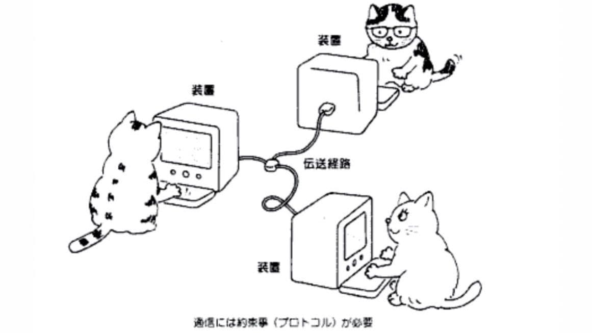

# Catalogo De La Existencia

Catalogo de la existencia en concordancia con el mandato opresivo de los tábanos mediante el cual nos extorsionan a construirles este aplicativo a cambio de no picarnos.

## Propuesta
Obtener palabras random de un diccionario, buscar imágenes random sobre esa palabra, mostrar la imagen con la palabra y su significado sobreimpreso.

## Partes
* Diccionario
* Buscador de imágenes
* Impresión de imagen y texto en pantalla

## Recursos
https://github.com/deepanprabhu/duckduckgo-images-api
